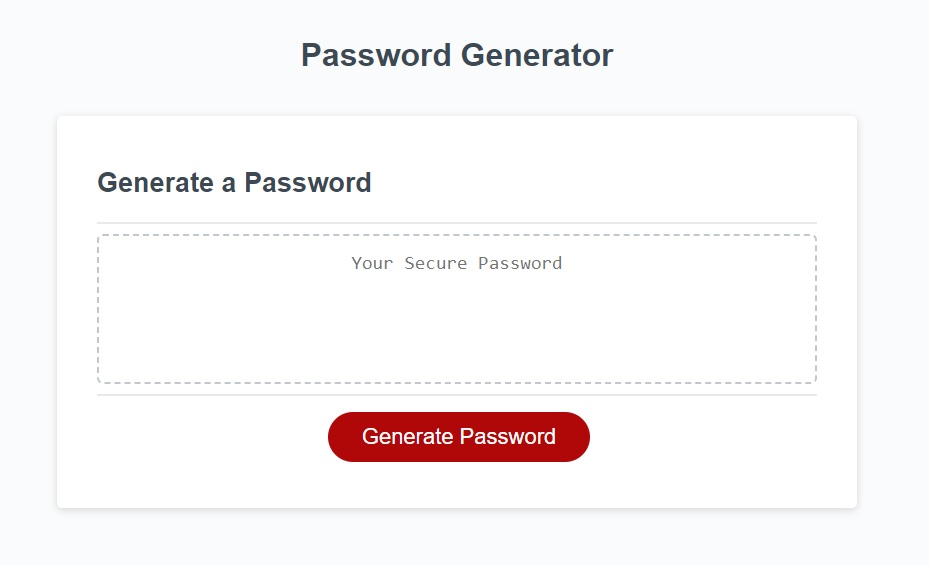

# PASSWORD GENERATOR

https://leopoldogurgel.github.io/password-generator/

## DESCRIPTION

This project delivers a password generator using some brain frying Javascript logic that took a lot of time to figure out, to research and to write it down. At least now you can put aside that "av0cad0" password. Make good use of this tool.

## RESOURCES

A lot of cool new features were added to the script of this project. Most of them came from UofT coding bootcamp, such as alert, prompt and confirm methods, if statements, building strings, math.floor and math.random. But at some point I had to make a string into a number and that came from StackOverflow.

## INSTRUCTIONS

At the landing page, you will find a very intuitive user interface for the web app. It has the title at the top, a box in which your password will appear and a big red button with "Generate Password" written on it. When you click that button, some questions will appear on your screen. Answer the questions following the instructions in each of them and you will have a super safe password in the end of the process.

## LICENSE

MIT License

Copyright (c) [2023] [Leopoldo Gurgel Barroso Pimentel]

Permission is hereby granted, free of charge, to any person obtaining a copy
of this software and associated documentation files (the "Software"), to deal
in the Software without restriction, including without limitation the rights
to use, copy, modify, merge, publish, distribute, sublicense, and/or sell
copies of the Software, and to permit persons to whom the Software is
furnished to do so, subject to the following conditions:

The above copyright notice and this permission notice shall be included in all
copies or substantial portions of the Software.

THE SOFTWARE IS PROVIDED "AS IS", WITHOUT WARRANTY OF ANY KIND, EXPRESS OR
IMPLIED, INCLUDING BUT NOT LIMITED TO THE WARRANTIES OF MERCHANTABILITY,
FITNESS FOR A PARTICULAR PURPOSE AND NONINFRINGEMENT. IN NO EVENT SHALL THE
AUTHORS OR COPYRIGHT HOLDERS BE LIABLE FOR ANY CLAIM, DAMAGES OR OTHER
LIABILITY, WHETHER IN AN ACTION OF CONTRACT, TORT OR OTHERWISE, ARISING FROM,
OUT OF OR IN CONNECTION WITH THE SOFTWARE OR THE USE OR OTHER DEALINGS IN THE
SOFTWARE.
